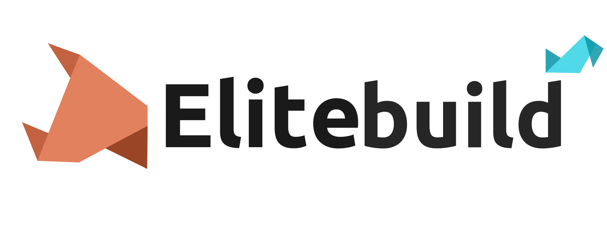

# Fegeya Elitebuild

## Small, powerful, work-in-progress build system. Written in Rust.

### Features:
 * No functions (all are built-ins)
 * All variables are global
 * Cross-platform (say 'thank you' to rust's standard lib)
 * Different syntax.
 * Preprocessor.
 * Aliases.
 * Language back-ends.

### A taste of Elite's syntax:
```cpp
set BIN_PATH      as "/usr/bin/"
set COMPILER      as "g++"
set COMPILER_PATH as "{BIN_PATH}{COMPILER}"

set SOURCE_FILE   as "example.cpp"
set OUTPUT        as "example"

for signal "start" [
  for exists "{BIN_PATH}clang++" [
    set COMPILER as "clang++"    
  ]
  
  for specific "linux" [
    println "OS: GNU/Linux"
  ]
  
  for specific "freebsd" [
    println "OS: FreeBSD"
  ]
  
  for specific "windows" [
    println "OS: Windows"
  ]
  
  for specific "openbsd" [
    println "OS: OpenBSD"
  ]
  
  for argument "build" [
    use exec "{COMPILER} {SOURCE_FILE} -o {OUTPUT}"
  
    for exists $OUTPUT [
      println "Build succeeded"
    ]
    
    use signal "exit"
  ]
   
  use signal "exit"
]
```

### Other implementations?
  * [For C++ as ElitedotC++](https://github.com/ferhatgec/elite.cpp)
  * [Gretea's Runtime uses Elite](https://github.com/ferhatgec/gretea)

## Transpiler back-ends? (oldest-)
  * [Python](https://github.com/ferhatgec/elitetopy)
  * [C++](https://github.com/ferhatgec/elitetopp)
  * [C](https://github.com/ferhatgec/elitetoc)
  * [Rust](https://github.com/ferhatgec/elitetors)
  * [Bash](https://github.com/ferhatgec/elitetobash)
  * [Perl](https://github.com/ferhatgec/elitetoperl)
  * [Go](https://github.com/ferhatgec/elitetogo)
  * [D](https://github.com/ferhatgec/elitetod)
  * [Scala](https://github.com/ferhatgec/elitetoscala)

### Elitebuild licensed under the terms of MIT License.
